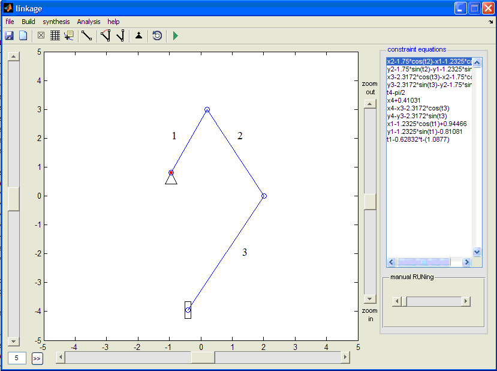
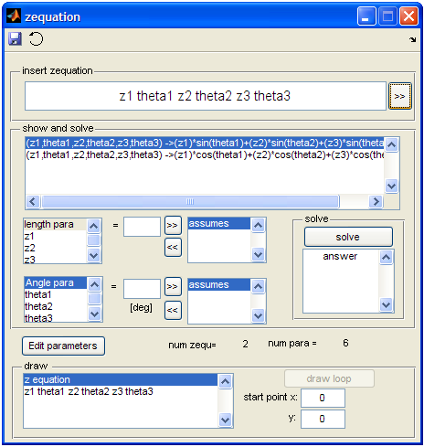

# linkage
# A Software for Analysis and Synthesis of Planar Mechanism with GUI

## 1- Analysis of the planar mechanisms

This repository showcases the creation of software aimed at conducting kinematic analysis and designing planar mechanisms. This project constituted a crucial component of the final bachelor's degree project, overseen by [Dr. Saeed Ebrahimi](https://scholar.google.com/citations?user=rJfFQY0AAAAJ&hl=en).
This software, developed using Matlab and equipped with a user-friendly graphical interface (GUI), consists of two main components. The first component focuses on the kinematic analysis of mechanisms, allowing users to select various elements and create links, prismatic joints, and revolute joints. Users can define the angular velocity of the actuator, and the software then simulates the motion of the mechanism while providing position, velocity, and acceleration data for its components.
The software's foundation is rooted in computational dynamics, drawing inspiration from the work of Prof. Shabana. Notably, the constraint equations are visible in the software's right-hand section, and numerical methods are employed to solve these equations.

 

## 2- Dimensional design for mechanisms

The software's second component focuses on dimensional design for mechanisms. It employs a dedicated app that enables users to input closed-loop equations and solve them to determine the necessary dimensions. Moreover, the software offers a variety of mechanisms suited for different applications, such as those designed for generating straight or circular paths, and users can conveniently choose the desired mechanism type.

 
